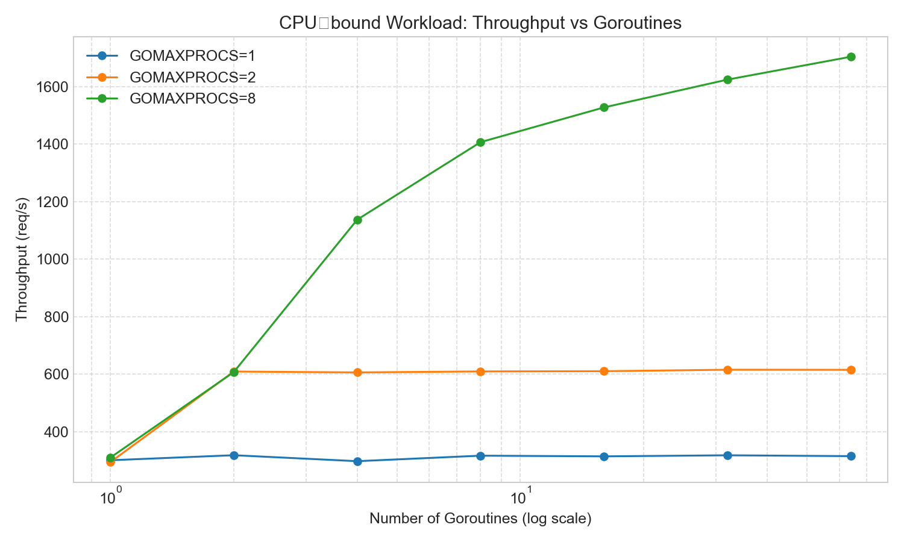
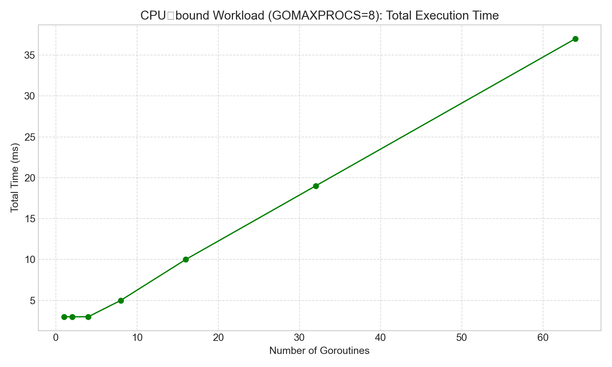
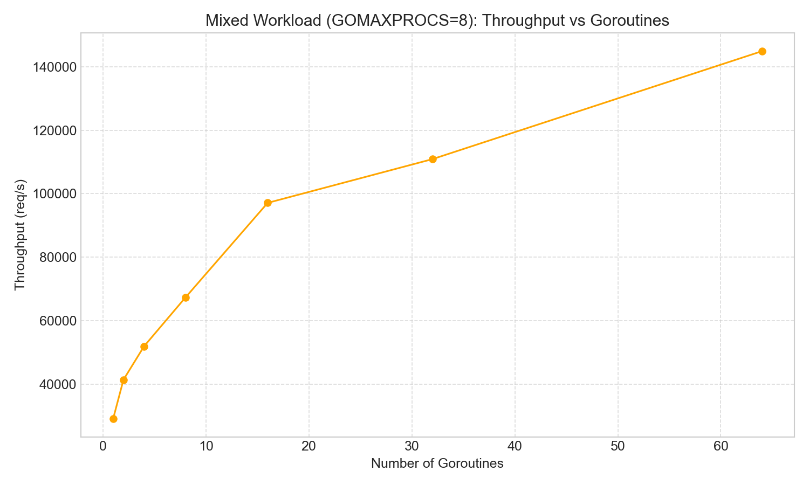
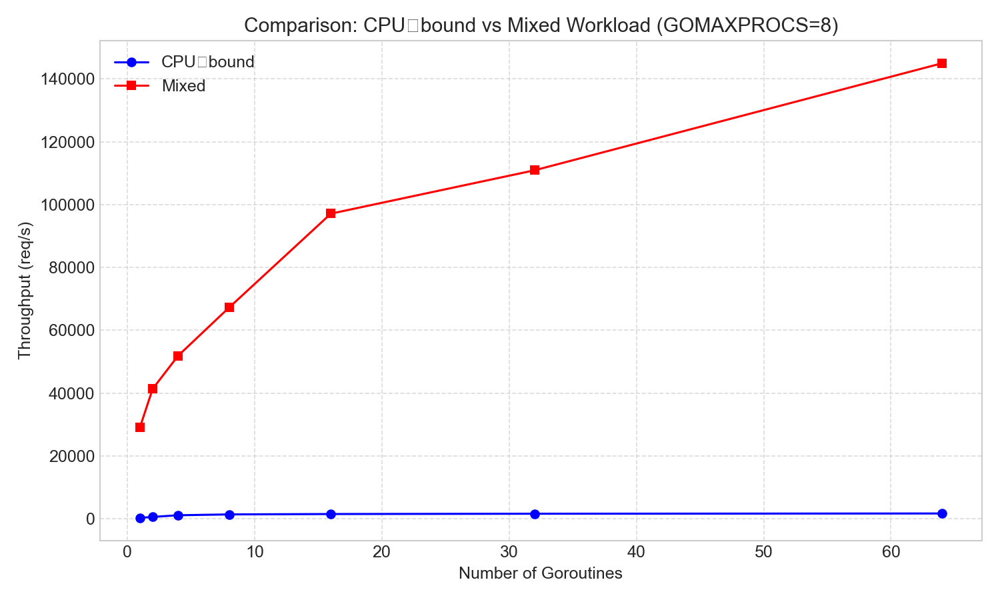

# Part 2: Concurrency, Scheduling and Context Switching Effects

## Overview

This program investigates how the number of goroutines, the type of workload, and the value of `GOMAXPROCS` affect performance in Go.

We measure two main metrics:

- **Total execution time**
- **Throughput (completed goroutines per second)**

Two types of workloads are used:

### CPU‑bound workload
A heavy floating‑point computation loop with **10 million iterations per goroutine**.

This workload:
- uses CPU heavily
- has **no shared resources**
- highlights **parallel execution limits and context switching overhead**

### Mixed workload
A lighter computation (100k integer additions) followed by a **mutex‑protected shared counter update**.

This workload:
- includes synchronization
- introduces **lock contention**
- demonstrates how concurrency behaves with **shared resources**

Each configuration is executed **5 times** and the program reports **average results** to reduce measurement noise.

---

# Requirements Met

| Requirement | Status |
|-------------|--------|
| At least 7 goroutine counts | ✅ (1,2,4,8,16,32,64) |
| Three GOMAXPROCS values | ✅ (1,2,NumCPU=8) |
| Two workload types | ✅ CPU‑bound + Mixed |
| Required metrics measured | ✅ |
| Analysis provided | ✅ |
| Reproducible results | ✅ |

---

# Code Structure

The program consists of several components.

### cpuWork()

Performs heavy floating‑point computation:

```
for i := 0; i < 10_000_000; i++ {
    sum += float64(i) * 1.0001
}
```

This function:
- consumes CPU time
- has **no locks**
- represents a purely **CPU‑bound task**

---

### mixedWork()

```
sum += i
mu.Lock()
*counter++
mu.Unlock()
```

This function:

1. performs small computation
2. locks a **shared mutex**
3. increments a shared counter

This introduces **synchronization and contention** between goroutines.

---

### benchmark()

The benchmark function:

1. sets `runtime.GOMAXPROCS`
2. launches N goroutines
3. waits using `sync.WaitGroup`
4. measures execution time
5. calculates throughput

The experiment is repeated **5 times** and averaged.

---

# How to Run

Using the provided script:

```
chmod +x run_part2.sh
./run_part2.sh
```

Or manually:

```
go run main.go > part2_results.csv
```

The output CSV contains:

| Column | Description |
|------|------|
| Goroutines | Number of goroutines |
| Workload | CPU‑bound or Mixed |
| GOMAXPROCS | Maximum parallel threads |
| Runs | Number of repetitions |
| TotalTimeNs | Average time in nanoseconds |
| TotalTimeMs | Average time in milliseconds |
| ThroughputReqPerSec | Completed goroutines per second |

---

# Benchmark Results

The averaged benchmark results:

| Goroutines | Workload | GOMAXPROCS | TotalTime (ms) | Throughput |
|---|---|---|---|---|
| 1 | CPU | 1 | 3 | 300 |
| 1 | CPU | 8 | 3 | 310 |
| 2 | CPU | 8 | 3 | 607 |
| 4 | CPU | 8 | 3 | 1137 |
| 8 | CPU | 8 | 5 | 1406 |
| 16 | CPU | 8 | 10 | 1527 |
| 32 | CPU | 8 | 19 | 1624 |
| 64 | CPU | 8 | 37 | 1703 |
| 1 | Mixed | 8 | ~0 | 29k |
| 8 | Mixed | 8 | ~0 | 67k |
| 16 | Mixed | 8 | ~0 | 97k |
| 32 | Mixed | 8 | ~0 | 110k |
| 64 | Mixed | 8 | ~0 | 145k |

(*Sub‑millisecond results appear as 0.00ms due to measurement granularity.*)

---

# Graphical Analysis

The following graphs were generated from `part2_results.csv`.

---

# Graph 1 — CPU‑bound Throughput vs Goroutines



### Observations

- With **GOMAXPROCS=1**, throughput remains nearly constant (~300 req/s).
- With **GOMAXPROCS=2**, throughput doubles (~600 req/s).
- With **GOMAXPROCS=8**, throughput scales up significantly.

### Explanation

CPU‑bound workloads benefit directly from **true parallelism**.

When:

```
GOMAXPROCS = number of CPU cores
```

multiple goroutines can execute simultaneously.

However, once goroutines exceed available cores, improvements slow because the scheduler must **time‑slice execution**.

---

# Graph 2 — CPU‑bound Total Time vs Goroutines (GOMAXPROCS=8)



### Observations

Execution time grows approximately linearly:

| Goroutines | Time |
|---|---|
| 1 | ~3 ms |
| 8 | ~5 ms |
| 16 | ~10 ms |
| 32 | ~19 ms |
| 64 | ~37 ms |

### Explanation

Each goroutine performs a fixed amount of work.

When goroutines exceed CPU cores:

```
Total Time ≈ Total Work / Number of Cores
```

Additional goroutines increase scheduling overhead and waiting time.

---

# Graph 3 — Mixed Workload Throughput vs Goroutines



### Observations

Throughput increases dramatically:

| Goroutines | Throughput |
|---|---|
| 1 | 29k |
| 8 | 67k |
| 16 | 97k |
| 32 | 110k |
| 64 | 145k |

### Explanation

Mixed workloads include:

- computation
- mutex synchronization

Many goroutines allow the scheduler to **keep the CPU busy while others wait for locks**, improving overall throughput.

However the curve begins to flatten because of **mutex contention**.

---

# Graph 4 — CPU vs Mixed Workload Comparison



### Observations

Mixed workload throughput is **two orders of magnitude higher** than CPU‑bound throughput.

Example:

| Goroutines | CPU | Mixed |
|---|---|---|
| 8 | ~1400 | ~67000 |
| 64 | ~1700 | ~145000 |

### Explanation

The difference occurs because:

CPU‑bound tasks perform **heavy computation per goroutine**, so each task takes longer.

Mixed tasks perform **short work units**, allowing thousands of tasks to complete per second.

---

# Analysis — Required Questions

## 1. Effect of increasing goroutines on execution time

For CPU‑bound workloads, execution time increases nearly linearly once goroutines exceed CPU cores.

Example:

```
8 goroutines → 5 ms
64 goroutines → 37 ms
```

This shows that the scheduler must share CPU cores between many goroutines.

---

## 2. Does throughput always increase?

No.

Throughput increases initially but eventually reaches **diminishing returns**.

CPU example:

```
8 goroutines → 1406 req/s
64 goroutines → 1703 req/s
```

Large increases in goroutines produce only small gains.

---

## 3. Effect of GOMAXPROCS

Example with 64 CPU‑bound goroutines:

| GOMAXPROCS | Time | Throughput |
|---|---|---|
| 1 | 203 ms | 315 |
| 2 | 104 ms | 615 |
| 8 | 37 ms | 1703 |

Increasing `GOMAXPROCS` allows true **parallel execution** across CPU cores.

---

## 4. Which workload shows more context switching?

CPU‑bound workloads show stronger scheduling effects.

Because:

- goroutines are always runnable
- the scheduler must frequently **switch execution**

Mixed workloads often block on mutexes, reducing unnecessary context switches.

---

## 5. When does concurrency stop helping?

Concurrency stops helping when:

```
goroutines > CPU cores
```

For CPU workloads:

```
optimal ≈ number of cores
```

Beyond that point:

- context switching increases
- cache contention increases
- gains become minimal

